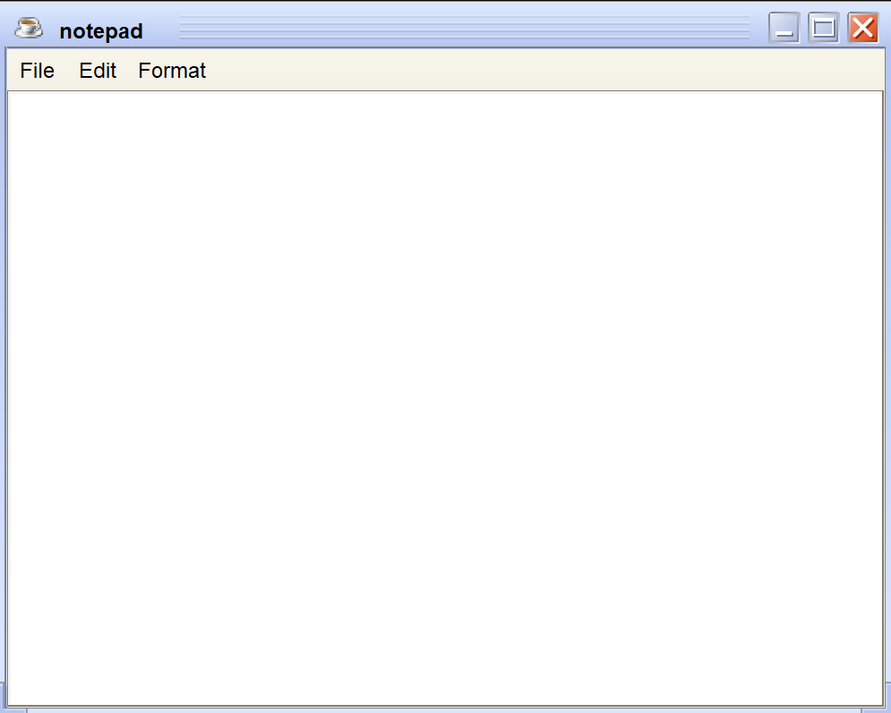
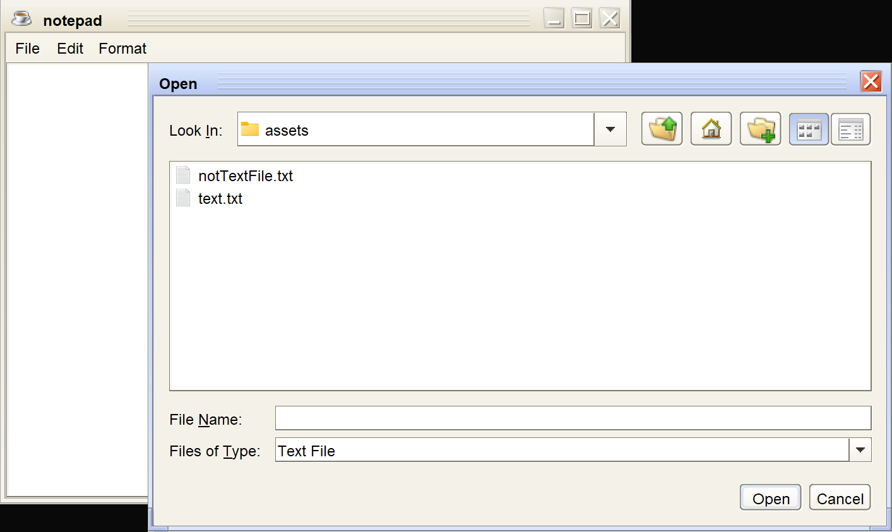
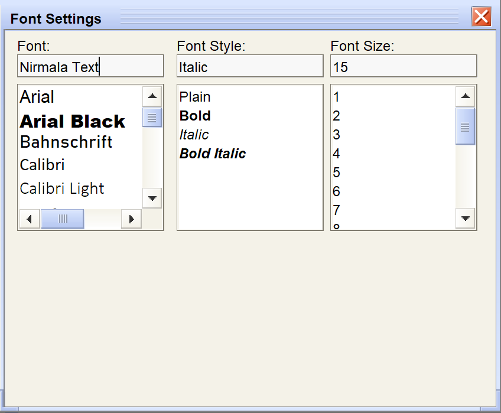

# Notepad Application

The main app has a different texture than original JFrame texture. I used JTattoo Look and Feel for my app. Here is the link you can download it from⬇️
https://jtattoo.de/index.html

I created a different directory in my project's directory for that jar file and added it into that directory.

For integrating it into my editor, firstly I opened Project Structure settings of my project. From there in Modules menu I pressed "+" button and selected Jar or Directories option. I selected the jar file. Then I added this code below;

<code>UIManager.setLookAndFeel(String className);</code>

The className can be get from website of JTattoo. It is **"com.jtattoo.plaf.smart.SmartLookAndFeel"**

This was the hardest part of the project. I watched the tutorial for Font area, then I tried to make Style area by myself, at the end I made Size area by myself.

 Struggling with code is best way of learning rather than just copy-writing it. I could finish this 80 min total project just by writing but I brain-worked on it 2 hours a day, searching uses of new things I saw. It's been 3 days I'm doing it and I really happy with this time.

←—————————————————————————————————————→

